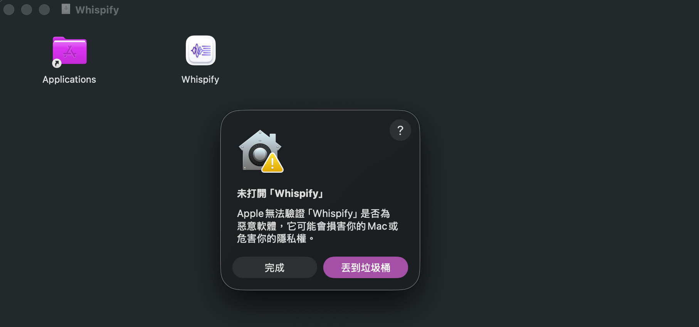
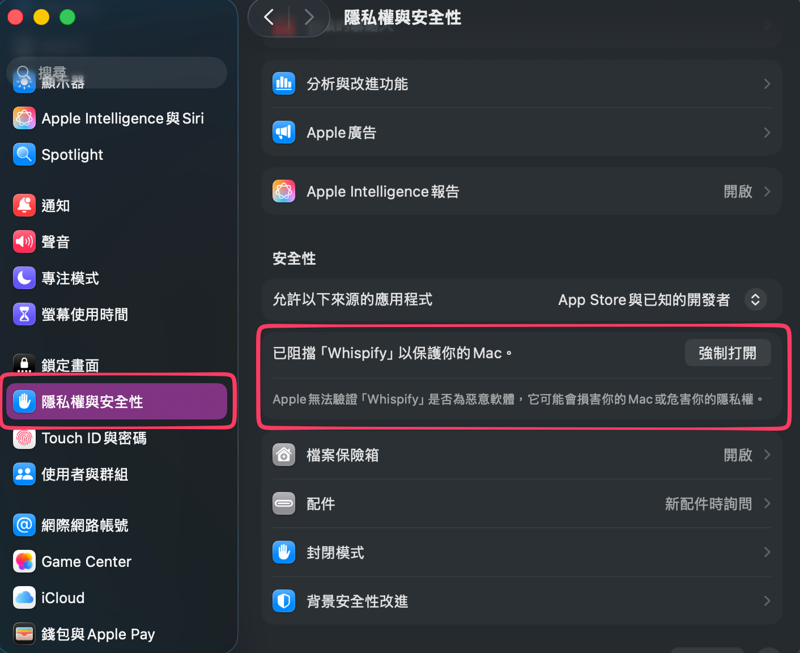

# 📢 Whispify App

歡迎來到 **Whispify App** 的官方回報中心！

此 repo 主要用於收集 Bug 回報與功能建議 (Issue Tracker)，同時也提供 App 下載。

Whispify 提供 **免費版** 與 **Pro 進階版** 服務，致力於為您提供最佳的使用體驗。無論您是免費用戶還是 Pro 用戶，我們都非常重視您的反饋。

👉 **官方網站:** [https://whispify.cashwu.com](https://whispify.cashwu.com)

---

## 📥 App 下載

您可以在此 repo 的 [Releases](https://github.com/cashwu/WhispifyApp/releases) 頁面下載最新版本的 App。

### ⚠️ 安全性提示（自我簽名 App）

由於目前 App 使用自我簽名，首次開啟時 macOS 會顯示安全性警告。請按照以下步驟操作：

1. 首次開啟 App 時，會出現無法打開的提示
   
   

2. 前往 **系統設定** → **隱私權與安全性**，找到相關的提示訊息，點選「**強制打開**」按鈕
   
   

---

## 📮 如何回報問題？

### 1. 🐛 錯誤回報 (Bug Report)
如果您在使用 App 時遇到異常（無論是免費功能或 Pro 功能）
1. 請先搜尋 [Issues](https://github.com/cashwu/WhispifyApp/issues) 看是否有類似問題
2. 建立新 Issue 時，請註明您使用的版本（Free 或 Pro）
3. 提供重現步驟、截圖、log 或螢幕錄影

### 2. ✨ 功能許願 (Feature Request)
希望 Whispify 加入新功能嗎？
*   歡迎提出您的想法！
*   如果您希望某個功能加入 **Pro 版本** 中，也請在描述中告訴我們

### 3. 💳 帳號與付費問題 (隱私安全)
**請勿在 GitHub Issue 公開您的個人帳號、信用卡號或訂單資訊！**
*   若您遇到 **Pro 升級失敗、扣款問題或帳號權限** 等涉及隱私的問題
*   請直接寄信至我們的支援信箱：`cashwugeek@icloud.com`

---

## 📝 回報守則

為了加速處理流程，請協助我們：
*   **保持禮貌**：我們致力於打造友善的社群
*   **資訊完整**：如果是 Bug，請告訴我們您的相關電腦資訊和 log
*   **保護隱私**：Issue 是公開的，請勿貼上任何敏感個資

---

## 🔗 相關連結

*   **官方網站**: [whispify.cashwu.com](https://whispify.cashwu.com)
